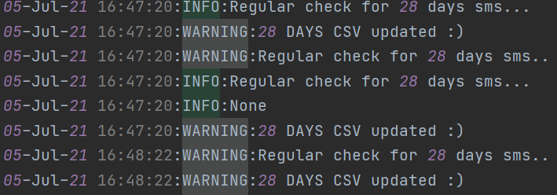
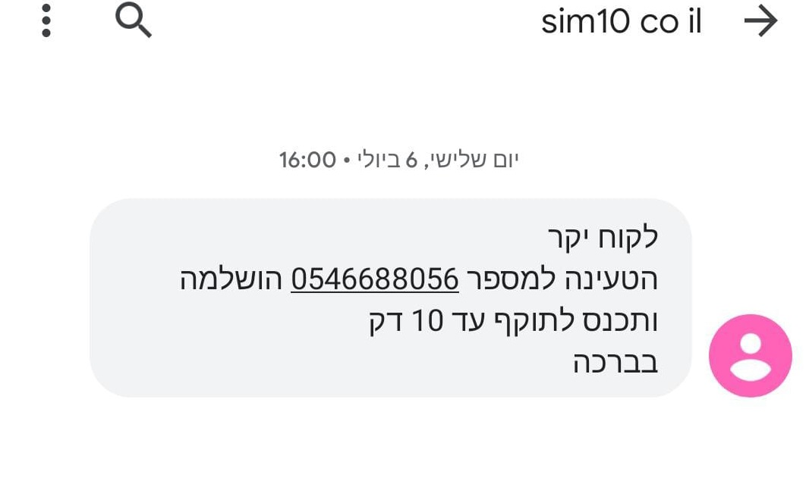

<!-- PROJECT SHIELDS -->
<!--
*** I'm using markdown "reference style" links for readability.
*** Reference links are enclosed in brackets [ ] instead of parentheses ( ).
*** See the bottom of this document for the declaration of the reference variables
*** for contributors-url, forks-url, etc. This is an optional, concise syntax you may use.
*** https://www.markdownguide.org/basic-syntax/#reference-style-links
-->

[![LinkedIn][linkedin-shield]][linkedin-url]
[![StackOverFlow][Stack-shield]][Stack-url]

<!-- PROJECT LOGO -->
 

    

  <h3 align="center">Selnium project</h3>
 
 
 
<!-- TABLE OF CONTENTS -->

  
Table of Contents

  <ol>
    <li>
      <a href="#about-the-project">About The Project</a>
      <ul>
        <li><a href="#built-with">Built With</a></li>
      </ul>
    </li>
    <li><a href="#usage">Usage</a></li>
    <li><a href="#contact">Contact</a></li>
  </ol>

<!-- ABOUT THE PROJECT -->
## About The Project
* SMS Confirmation project for www.sim10.co.il website 
As a freelancer i take projects for costumers ,this is a temporary project for a closed source website.
The client suggest Telecard services for turists etc.

* Firstly i connect with selenium to the manager profile and scan every 1 minute the orders page

* Secondly scrape the confirmed *(after tranzila and cellular provider confirmation)* new phone numbers registerd to the TELECARD of the costumers
then according to the time the order confirmed ---> send a SMS that the Mobility procces done completely.

* Thirdly, i save the phone numbers and the time i send the sms in csv file to compare to the next orders to avoid duplications.
A mobility package long for a 30 days , so i save the date, time and phone number i sent the first sms and check *(you can see Send28DaysSMS function)* every day if the mobility package got 2 days left if so --> sending another sms but this is a reminder SMS.

### Built With
* [Chrome driver](https://chromedriver.chromium.org/downloads)
* [Twillio](https://www.twilio.com/messaging)

<!-- USAGE EXAMPLES -->
## Usage
<h3>Logs are all over the projects and ensure the reliabillity of the system</h3>
 

    

<h2>Example of the SMS output to the costumer arranged with all the information that scraped from the manager order page.</h2>
<h3>Registerd ALPHANUMERIC name for the Twillio API phone number</h3>

                                                            

*Importent* The ## TwentyDAysPhoneList.csv ##- perform as the database of the phonenumbers that already got the first message with *Send28DaysSMS func* i evaluate how much time left for the costumer package that relevant to the exact phone number to finish and then sends the costumer a reminder for renew/throw the telecart to recycle bin.
                                                               

<!-- CONTACT -->
## Contact
Project Link: [https://github.com/Benco351/DevOpsEngineer](https://github.com/Benco351/DevOpsEngineer)
                                                               
Linkedin: [https://www.linkedin.com/in/devops-ben-cohen/](https://www.linkedin.com/in/devops-ben-cohen/)

<!-- MARKDOWN LINKS & IMAGES -->
<!-- https://www.markdownguide.org/basic-syntax/#reference-style-links -->
[linkedin-shield]: https://img.shields.io/badge/-LinkedIn-black.svg?style=for-the-badge&logo=linkedin&colorB=555
[linkedin-url]: https://www.linkedin.com/in/devops-ben-cohen/
[Stack-shield]: https://img.shields.io/twitter/url?color=orange&label=StackOverFlow&style=for-the-badge&url=https%3A%2F%2Fstackoverflow.com%2Fusers%2F16339848%2Fben-cohen%3Ftab%3Dquestions
[Stack-url]: https://stackoverflow.com/users/16339848/ben-cohen?tab=questions
